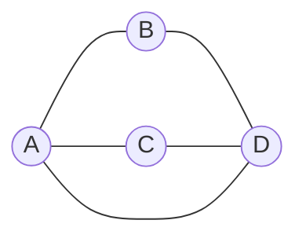

## 分类

### 无向图

图中所有的边没有方向，称为无向图

### 有向图

图中所有的边有方向，称为有向图

### 有向图

图中所有的边有个值表示权重，称为有权图

### 连通图

图中任意 2 个节点都能找到路径进行连接，称为连通图

## 实现

图的表示方法有 2 种，邻接链表和邻接矩阵。如果是密集图（边与节点的数量比例比较大）或需要快速判断 2 个节点是否有边相连，选择邻接矩阵比较合适。如果是稀疏图（边与节点数量比例比较小），选择邻接链表比较合适。



### 邻接链表

```js
// 使用对象表示，每个键对应一个节点，值是一个包含相邻节点的数组。
class Graph {
  constructor() {
    this.data = {}
  }

  addNode(node) {
    if (!this.data[node]) {
      this.data[node] = []
    }
  }

  addEdge(node1, node2) {
    this.addNode(node1)
    this.addNode(node2)
    this.data[node1].push(node2)
    this.data[node2].push(node1)
  }

  display() {
    for (const node in this.data) {
      console.log(`${node} -> ${this.data[node].join(', ')}`)
    }
  }
}

const graph = new Graph()
graph.addEdge('A', 'B')
graph.addEdge('A', 'C')
graph.addEdge('B', 'D')
graph.display()
/**
 * 输出
 * A -> B, C
 * B -> A, D
 * C -> A
 * D -> B
 */
```

### 邻接矩阵

```js
// 使用二维数组来表示，行和列表示节点，值表示节点之间是否存在边。
class Graph {
  constructor(size) {
    this.size = size
    this.matrix = Array.from({ length: size }, () => Array(size).fill(0))
  }

  addEdge(node1, node2) {
    this.matrix[node1][node2] = 1
    this.matrix[node2][node1] = 1
  }

  display() {
    console.log(this.matrix)
  }
}

const graph = new Graph(4)
graph.addEdge(0, 1)
graph.addEdge(0, 2)
graph.addEdge(1, 3)
graph.display()
/**
 * 输出
 * [
 *  [ 0, 1, 1, 0 ],
 *  [ 1, 0, 0, 1 ],
 *  [ 1, 0, 0, 0 ],
 *  [ 0, 1, 0, 0 ]
 * ]
 */
```
