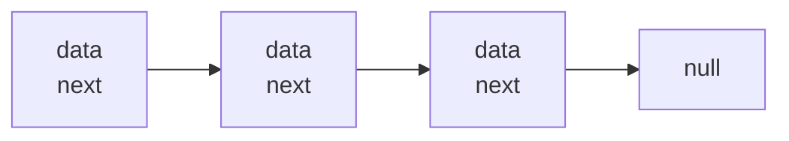
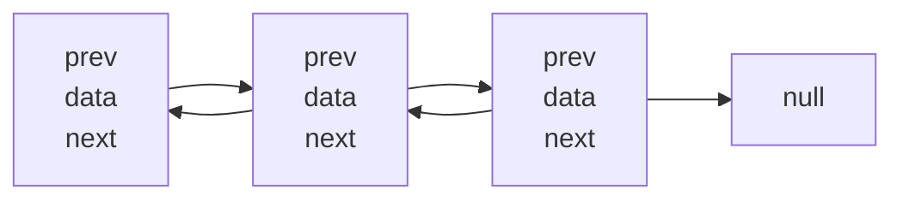
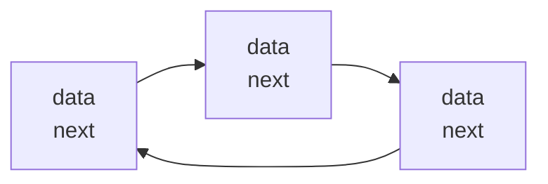
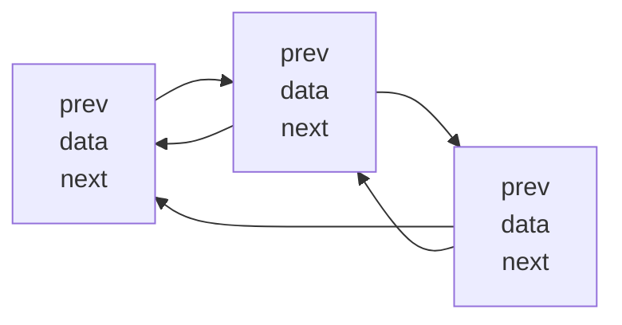
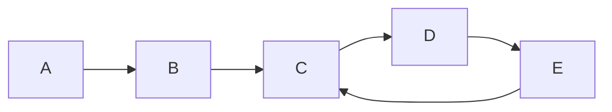
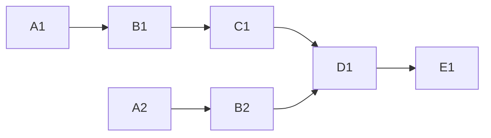
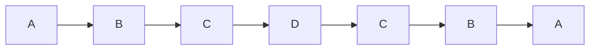

## 链表分类

### 单向链表



### 双向链表



### 单向循环链表



### 双向循环链表



## 实现

```js
class Node {
  constructor(data) {
    this.data = data
    this.next = null
  }
}

const n1 = new Node(1)
const n2 = new Node(2)
const n3 = new Node(3)

n1.next = n2
n2.next = n3
```

## 应用

### 环形链表



```js
/**
 * 1. 创建两个指针，一开始都指向第一个节点，然后开始循环，
 *  在循环中，指针 1 每次向下移动 1 个节点，指针 2 每次向下移动 2 个节点，
 *  比较这两个指针指向的节点是否相同，相同则说明链表有环。
 */
class Node {
  constructor(data) {
    this.data = data
    this.next = null
  }
}

const n1 = new Node(1)
const n2 = new Node(2)
const n3 = new Node(3)
const n4 = new Node(4)
const n5 = new Node(5)

n1.next = n2
n2.next = n3
n3.next = n4
n4.next = n5
n5.next = n3

const isCircularLinkedList = head => {
  if (typeof head !== 'object' || head === null || !head.next) {
    return false
  }

  let point1 = head
  let point2 = head
  do {
    point1 = point1.next
    point2 = point2.next?.next
  } while (point1 && point2 && point1 !== point2)

  if (point1 === point2) {
    return true
  }
  return false
}

isCircularLinkedList(n1) // true
```

### 相交链表



```js
/**
 * 1. 两个没有环的链表如果相交于某个节点，则后面节点是相同的，所以两个链表的最后一个节点相同则表示相交
 * 2. 如何找到第一个相交的节点？先算出两个链表的长度差 diffLen，接着先让比较长的链表遍历 diffLen，
 *   然后两个链表同时遍历，如果当前的节点相同则就是第一个相交的节点
 */
class Node {
  constructor(data) {
    this.data = data
    this.next = null
  }
}

const a1 = new Node('A1')
const b1 = new Node('B1')
const c1 = new Node('C1')
const d1 = new Node('D1')
const e1 = new Node('E1')

a1.next = b1
b1.next = c1
c1.next = d1
d1.next = e1

const a2 = new Node('A2')
const b2 = new Node('B2')

a2.next = b2
b2.next = d1

const hasIntersectNode = (head1, head2) => {
  if (!head1 || !head2) {
    return null
  }
  let len1 = 0
  let len2 = 0
  let node1 = head1
  let node2 = head2

  while (node1.next) {
    len1 += 1
    node1 = node1.next
  }

  while (node2.next) {
    len2 += 1
    node2 = node2.next
  }

  if (node1 !== node2) {
    return null
  }

  if (len1 > len2) {
    node1 = head1
    node2 = head2
  } else {
    node1 = head2
    node2 = head1
  }

  let diffLen = Math.abs(len1 - len2)
  while (diffLen > 0) {
    diffLen -= 1
    node1 = node1.next
  }

  while (node1 && node2 && node1 !== node2) {
    node1 = node1.next
    node2 = node2.next
  }

  return node1
}

hasIntersectNode(a1, a2) // D1
```

### 回文链表



```js
/**
 * 1. 遍历链表，同时正向和反向拼接每个节点的数据。如果正向和反向拼接的数据相同则是回文链表
 */
class Node {
  constructor(data) {
    this.data = data
    this.next = null
  }
}

const a1 = new Node('A')
const b1 = new Node('B')
const c1 = new Node('C')
const d1 = new Node('B')
const e1 = new Node('A')

a1.next = b1
b1.next = c1
c1.next = d1
d1.next = e1

const isPalindromeList = head => {
  let a = ''
  let b = ''
  while (head) {
    a = `${a}${head.data}`
    b = `${head.data}${b}`
    head = head.next
  }

  return a === b
}

isPalindromeList(a1) // true
```
