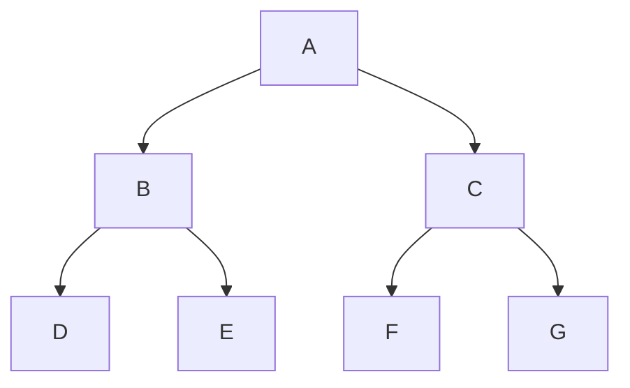
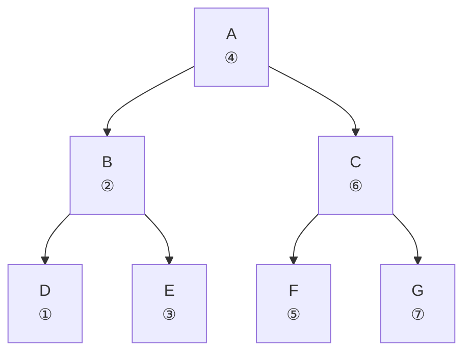
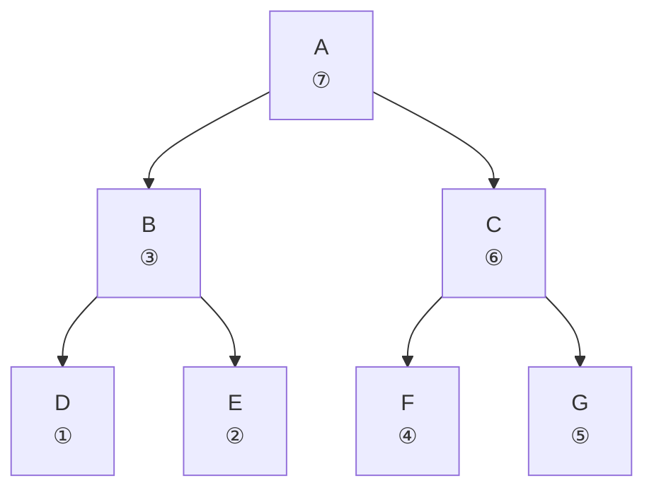
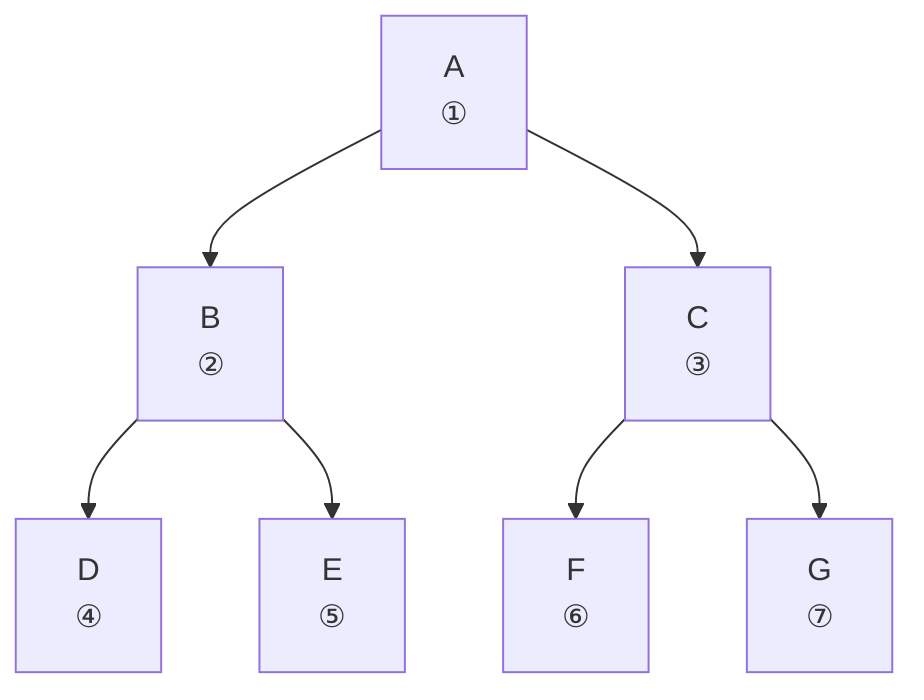

## 分类

### 无序树

树中任意节点的子节点没有特定的顺序，子节点的排列顺序不影响树的结构和性质。如 N 叉树就是无序树

### 有序树

树中任意节点的子节点有特定的顺序，这意味着每个节点的子节点可以被视为一个有序列表。如二叉树就是有序树

### 二叉树

每个节点最多含有 2 个子节点的树

### 完全二叉树

除最后一层外，每个节点都含有 2 个子节点，且所有叶子节点左对齐，中间不能有空缺的树

### 满二叉树（又称完美二叉树）

除叶子节点外，每个节点都含有 2 个子节点的树

## 实现

### 满二叉树

```js
class Node {
  constructor(data) {
    this.data = data
    this.left = null
    this.right = null
  }
}

const nA = new Node('A')
const nB = new Node('B')
const nC = new Node('C')
const nD = new Node('D')
const nE = new Node('E')
const nF = new Node('F')
const nG = new Node('G')

nA.left = nB
nA.right = nC
nB.left = nD
nB.right = nE
nC.left = nF
nC.right = nG
```



## 遍历

### 深度优先遍历

- 先序遍历（又称先根遍历），顺序为 ABDECFG (根->左->右)


- 中序遍历（又称中根遍历），顺序为 DBEAFCG（左-根-右）



- 后序遍历（又称后根遍历），顺序为 DEBFGCA（左-右-根）



### 广度优先遍历

- 层序遍历，顺序为 ABCDEFG


