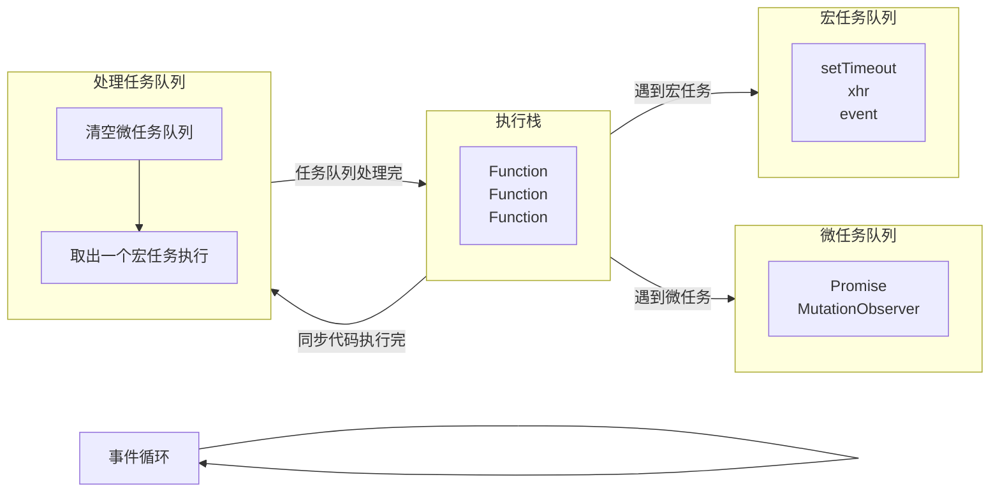

## 什么是事件循环？

简单来说，事件循环就是 JavaScript 的运行机制。



1. 执行全局 Script 代码，执行过程中遇到异步代码，会把异步代码放到宏任务队列或微任务队列
2. 全局 Script 代码执行完毕，执行栈清空
3. 依次把微任务队列的任务放到执行栈执行，直到清空微任务队列
4. 取出宏任务队列的第一个任务放到执行栈执行
5. 重复 3 和 4 步骤
6. 重复 3 和 4 步骤
7. ...不断循环

**注意：在 3 和 4 步骤之间浏览器会尝试进行页面的渲染，即在所有微任务执行完毕和第一个宏任务执行前**

## 示例

```js
console.log(1)

setTimeout(() => {
  console.log(2)
  Promise.resolve().then(() => {
    console.log(3)
  })
})

new Promise((resolve, reject) => {
  console.log(4)
  resolve(5)
}).then(res => {
  console.log(res)
})

setTimeout(() => {
  console.log(6)
})

console.log(7)
```

输出结果

```js
1
4
7
5
2
3
6
```
