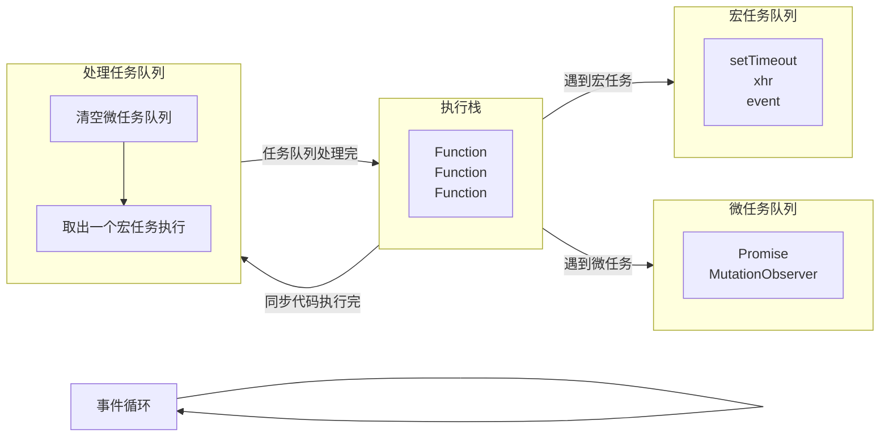

```mermaid
flowchart LR
    E[事件循环] --> E
    执行栈 -- 遇到宏任务 --> 宏任务队列
    执行栈 -- 遇到微任务 --> 微任务队列
    执行栈 -- 同步代码执行完 --> 处理任务队列 -- 任务队列处理完 --> 执行栈
    subgraph 执行栈
       S[<div class="flex flex-col gap-2 p-4"><div class="border border-dashed border-warning px-2">Function</div><div class="border border-dashed border-warning px-2">Function</div><div class="border border-dashed border-warning px-2">Function</div></div>]
    end
    subgraph 宏任务队列
      T[<div class="flex gap-4 py-2"><div class="px-2 border border-dashed border-warning">setTimeout</div><div class="px-4 border border-dashed border-warning">xhr</div><div class="px-4 border border-dashed border-warning">event</div></div>]
    end
    subgraph 微任务队列
      M[<div class="flex gap-4 py-2"><div class="px-2 border border-dashed border-warning">Promise</div><div class="px-4 border border-dashed border-warning">MutationObserver</div></div>]
    end
    subgraph 处理任务队列
      N1[清空微任务队列] --> N2[取出一个宏任务执行]
    end
```
